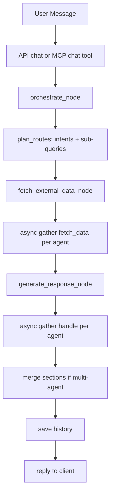

# REAME - Kiến trúc Deep Dive cho Chatbot MCP Multi-Agent

Tài liệu này mô tả chi tiết và ở mức triển khai thực tế cách toàn bộ project hoạt động: từ prompt, routing, search, pipeline async multi-agent, đến cơ chế MCP server và cách mở rộng hệ thống.

## 1) Mục tiêu hệ thống

Project được thiết kế để giải bài toán trợ lý hội thoại theo miền nghiệp vụ, trong đó:

- Phân luồng thông minh theo intent (SGroup, AI Team, Weather, News, IT, Module A/B).
- Có chế độ multi-agent bất đồng bộ cho câu hỏi đa ý trong một lượt chat.
- Kết hợp tri thức tĩnh nội bộ (JSON + docs) và nguồn động bên ngoài (Weather API, News, Search, YouTube RSS).
- Hỗ trợ cả giao diện HTTP (FastAPI) và giao thức MCP qua stdio.

## 2) Cấu trúc thành phần

Workspace có 2 tầng chính:

- Tầng dữ liệu ngoài ứng dụng: data/
- Tầng ứng dụng: sgroup-chatbot/

Trong sgroup-chatbot:

- api/: HTTP API (chat/health/clear)
- graph/: pipeline LangGraph (orchestrate -> fetch -> generate)
- agents/: agent theo domain
- services/: tích hợp API ngoài + tri thức + LLM wrapper
- modules/: agent module mở rộng (module_a/module_b)
- static/: giao diện web chat
- mcp_server.py: MCP server tool-based (chat, weather, news, clear_chat, health)

## 3) Luồng xử lý end-to-end

### 3.1 HTTP flow

1. Client gửi POST /api/chat với message + session_id.
2. API tạo AgentState ban đầu.
3. agent_graph.ainvoke chạy 3 node:
- orchestrate_node
- fetch_external_data_node
- generate_response_node
4. Kết quả final_response được lưu vào memory_service theo session_id.
5. API trả về reply + agent_used.

### 3.2 MCP flow

1. MCP client spawn process python mcp_server.py qua stdio.
2. Client gọi list_tools, sau đó call_tool.
3. Tool chat chạy cùng graph pipeline như HTTP chat.
4. Tool weather/news trả dữ liệu normalize trực tiếp.

## 4) Agent orchestration và multi-agent async

### 4.1 Single-intent

Orchestrator áp dụng fast-route theo regex trước để giảm lỗi phân luồng:

- general
- weather
- ai_team
- sgroup_knowledge
- news
- it_knowledge

Nếu không match fast-route, fallback sang LLM router (GeminiService wrapper, thực tế gọi Groq chat-completions).

### 4.2 Multi-intent

Cơ chế mới dùng plan_routes(message):

- Tách câu thành clauses theo từ nối: và, rồi, sau đó, and, then, dấu phẩy/chấm phẩy.
- Với câu không tách được nhưng chứa nhiều intent, dùng collect_fast_intents để bắt đa intent trong cùng một clause.
- Trả ra:
- selected_agents: list agent cần chạy
- agent_queries: map agent -> sub-query

### 4.3 Fan-out/Fan-in bất đồng bộ

Trong graph/nodes.py:

- fetch_external_data_node: asyncio.gather trên toàn bộ selected_agents để fetch song song.
- generate_response_node: asyncio.gather tiếp để handle song song từng agent.
- Nếu nhiều agent, hệ thống ghép kết quả thành các section [1], [2], [3]...

Đây là điểm then chốt giúp câu kiểu:

- thong tin SGroup va du an AI Team
- thong tin SGroup va du bao thoi tiet

được trả đủ cả hai phần trong một response.

## 5) Prompting strategy và deterministic strategy

Hệ thống dùng chiến lược lai:

- Rule-first (regex routing + deterministic handlers) cho các miền dễ sai fact.
- LLM-second cho các miền mở.

### 5.1 BaseAgent

BaseAgent.handle sẽ:

- Nhét external_data vào context.
- Gắn language instruction bắt buộc tiếng Việt có dấu.
- Gọi GeminiService.chat.

### 5.2 Deterministic agents

Một số agent override handle để tránh LLM rewrite gây sai dữ liệu:

- SGroupKnowledgeAgent: trả trực tiếp external_data đã grounded.
- AITeamAgent: trả trực tiếp dữ liệu từ ai-team.json (get_ai_team_answer).
- WeatherAgent: trả trực tiếp block dự báo từ Visual Crossing.
- NewsAgent: trả trực tiếp danh sách tin đã lọc.

Điều này giảm hallucination và tránh text noise/encoding lỗi.

## 6) Knowledge layer và data governance

knowledge_service.py là lõi tri thức nội bộ:

- Resolve DATA_DIR động từ settings.
- Read JSON records + doc excerpt từ data/docs.
- Tokenize và score record theo title/summary/keywords.
- Có nhánh trả lời SGroup theo intent cụ thể (chủ nhiệm, phó chủ nhiệm, ban nội bộ, trưởng chuyên môn...).
- Có nhánh AI Team riêng:
- overview
- project/module detail
- member list unverified có gắn trạng thái CHUA XAC MINH URL.

Mô hình dữ liệu sourceType:

- official: đã xác minh từ URL chính thức
- unverified: dữ liệu do người dùng cung cấp chưa có bằng chứng URL
- static: tri thức nội bộ hệ thống

Đây là lớp guardrail dữ liệu quan trọng cho câu trả lời factual.

## 7) Search stack chi tiết

### 7.1 IT Knowledge

it_knowledge.py chạy song song:

- Exa semantic search (nếu có EXA_API_KEY)
- Brave web search (nếu có BRAVE_API_KEY)
- YouTube RSS search (luôn có thể chạy)

Kết quả trả về dạng tổng hợp đa nguồn theo section.

### 7.2 YouTube enrichment

youtube_service.py:

- Query RSS search_query.
- Parse video_id từ watch/youtu.be/shorts/embed.
- Dedupe bằng video_id/url.
- Trả thêm embed_url + thumbnail.

Frontend app.js:

- Detect URL YouTube trong nội dung bot.
- Render grid iframe nhúng trực tiếp trong bubble.
- Hỗ trợ tối đa 10 video, lazy load.

### 7.3 News

news_service.py:

- Mode detection: latest/topic/keyword.
- Nguồn: NewsAPI + RSS fallback.
- Lọc garbled text, dedupe theo url/title.
- Sports-aware filtering riêng theo keyword thể thao.

### 7.4 Weather

weather_service.py + weather agent:

- Provider: Visual Crossing timeline API.
- Hỗ trợ date range, explicit date, quá khứ/tương lai.
- Multi-location trong một câu.
- Chuẩn hóa hiển thị độ C, m/s, gợi ý thời tiết.

## 8) MCP server deep dive

mcp_server.py dùng FastMCP và expose tool:

- chat(message, session_id)
- weather(location)
- news(query)
- clear_chat(session_id)
- health()

Transport:

- stdio (mcp.run transport stdio)

Ý nghĩa triển khai:

- Dễ nhúng vào MCP clients (IDE agents, orchestration tools).
- Không cần mở thêm HTTP port riêng cho MCP.
- Tool-based contract rõ ràng, dễ compose vào agent framework khác.

### 8.1 Định dạng dữ liệu tool

- chat trả reply + agent_used + session_id
- weather trả normalized fields và raw payload
- news trả list article chuẩn hóa

## 9) Session memory và state

memory_service.py lưu in-memory:

- _sessions là defaultdict list
- MAX_TURNS = 20 (tương ứng tối đa 40 messages role-based)

Ý nghĩa:

- Nhanh cho local/dev.
- Không bền vững qua restart process.
- Không phù hợp scale-out nhiều instance nếu chưa thay bằng Redis/DB.

## 10) Cấu hình môi trường

Trọng tâm trong .env:

- GROQ_API_KEY, GROQ_BASE_URL, GROQ_MODELS
- VISUALCROSSING_API_KEY
- EXA_API_KEY, BRAVE_API_KEY, NEWS_API_KEY
- DATA_DIR=../data

Lưu ý kỹ thuật:

- settings có cả GOOGLE_* để tương thích cũ, nhưng LLM wrapper hiện tại chạy qua Groq.
- /api/health hiện trả model gemini-2.5-flash (thông tin này mang tính legacy label).

## 11) Cách prompt hiệu quả theo từng miền

### 11.1 Prompt đơn miền

- SGroup: Hỏi rõ role hoặc thực thể
- Ví dụ: Truong ban truyen thong la ai

- AI Team: Hỏi theo module hoặc project
- Ví dụ: Chi tiet du an ASR Translate TTS

- IT: Hỏi theo chủ đề + mức độ
- Ví dụ: Top tai lieu hoc FastAPI cho backend junior

- Weather: Hỏi địa điểm + mốc thời gian
- Ví dụ: Du bao thoi tiet Da Nang ngay mai va ngay kia

### 11.2 Prompt đa miền trong một câu

- Dùng liên từ và, sau đó, rồi
- Ví dụ: Cho thong tin SGroup va sau do tom tat du an AI Team

Hệ thống sẽ tự fan-out đa agent và ghép trả lời.

## 12) Pipeline minh họa

## 13) Điểm mạnh hiện tại

- Hybrid deterministic + LLM nên ổn định factual hơn bot thuần LLM.
- Multi-agent async đã chạy thật trong graph.
- Search đa nguồn và có cơ chế quality filtering.
- MCP + HTTP cùng tồn tại, tiện tích hợp.

## 14) Technical debt và cải tiến đề xuất

1. Đồng bộ AgentState giữa api/router và mcp_server:
- mcp_server chat đang khởi tạo state theo schema cũ (thiếu selected_agents, agent_queries, external_data_map, final_responses).
- Nên cập nhật để đồng nhất 100% với pipeline mới.

2. Health endpoint:
- Nên phản ánh model thực tế từ Groq wrapper thay vì label gemini legacy.

3. Memory backend:
- Nâng từ in-memory sang Redis/Postgres để bền vững.

4. Observability:
- Thêm tracing theo request_id, log latency per node và per agent.

5. Test coverage:
- Thêm unit tests cho plan_routes, split_clauses, collect_fast_intents.
- Thêm integration tests cho multi-agent response merge.
- Thêm regression tests cho deterministic factual branches.

## 15) Cách mở rộng hệ thống với agent mới

Quy trình chuẩn:

1. Tạo file agent mới trong agents/ kế thừa BaseAgent.
2. Thêm agent vào _agents map trong graph/nodes.py.
3. Cập nhật regex fast-route và/hoặc LLM router prompt trong orchestrator.py.
4. Nếu cần dữ liệu ngoài, tạo service trong services/.
5. Nếu cần deterministic output, override handle.
6. Bổ sung test và cập nhật tài liệu.

## 16) Chạy project và MCP nhanh

### 16.1 App

- cd sgroup-chatbot
- python3 main.py

### 16.2 MCP server

- cd sgroup-chatbot
- python3 mcp_server.py

### 16.3 MCP client test

- python3 test_mcp_client.py

## 17) Kết luận

Project hiện là một nền tảng chatbot đa tác tử theo hướng production-ready cho use-case nội bộ:

- Có tri thức structured,
- Có orchestration theo intent,
- Có fan-out async multi-agent,
- Có kênh tích hợp chuẩn MCP,
- Có khả năng mở rộng theo module nghiệp vụ.

Nếu muốn đẩy lên mức production enterprise, bước tiếp theo quan trọng nhất là:

- chuẩn hóa state contract giữa mọi entrypoint,
- bổ sung persistence + tracing,
- thiết lập bộ test regression tự động cho routing/factual outputs.
