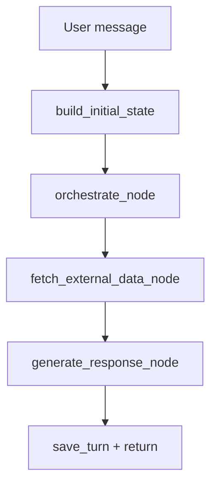

# SGroup Multi-Agent Chatbot

Chatbot da tac tu (multi-agent) cho bai toan noi bo SGroup, gom 2 cach tich hop:
- HTTP app (FastAPI + Web UI)
- MCP server qua stdio (de MCP client goi tool)

He thong dung LangGraph de dieu phoi pipeline, va cac agent theo domain de xu ly theo intent.

## 1) Kien truc tong quan

Thanh phan chinh:
- `main.py`: khoi tao FastAPI + static frontend
- `api/`: REST endpoints (`/api/chat`, `/api/health`, xoa history)
- `graph/`: LangGraph runtime state + nodes + graph builder
- `agents/`: bo agent domain (general, weather, news, IT, SGroup, AI Team)
- `modules/`: agent mo rong (`module_a`, `module_b`)
- `services/`: layer tich hop du lieu ngoai + tri thuc + LLM + memory
- `mcp_server.py`: MCP server tool-based qua stdio
- `static/`: giao dien web chat
- `tests/`: test state factory va dong bo state entrypoint

## 2) Luong xu ly end-to-end

### 2.1 HTTP flow

1. Client goi `POST /api/chat` voi `message`, `session_id`.
2. API tao state bang `build_initial_state`.
3. `agent_graph.ainvoke(state)` chay 3 node:
   - `orchestrate_node`
   - `fetch_external_data_node`
   - `generate_response_node`
4. Ket qua `final_response` duoc luu vao memory theo `session_id` (short + long memory).
5. API tra `reply`, `agent_used`, `session_id`.

### 2.2 MCP flow

1. MCP client spawn process `python mcp_server.py` (transport `stdio`).
2. Client `initialize` -> `list_tools` -> `call_tool`.
3. Tool `chat` dung chung LangGraph pipeline nhu HTTP.
4. Tool `weather/news/clear_chat/health` tra du lieu truc tiep theo schema tool.

## 3) Pipeline chi tiet (LangGraph)

Graph duoc build trong `graph/builder.py`:
- Entry point: `orchestrate`
- Sau do: `fetch_external_data`
- Cuoi cung: `generate_response`
- Ket thuc: `END`



State runtime hien tai (tom tat):
- `selected_agent`: agent chinh (single)
- `selected_agents`: danh sach agent khi multi-intent
- `agent_queries`: map agent -> sub-query
- `external_data_map`: map agent -> du lieu fetch duoc
- `final_responses`: map agent -> response tung nhanh

## 4) Agent hoat dong nhu the nao

## 4.1 Orchestrator (chon agent)

`agents/orchestrator.py` dung chien luoc lai:
- Rule-first fast route (regex)
- Fallback LLM router khi khong match rule

Danh sach agent co san:
- `general`
- `ai_team`
- `weather`
- `news`
- `it_knowledge`
- `sgroup_knowledge`
- `module_a`
- `module_b`

## 4.2 Multi-agent

He thong da la multi-agent that:
- Tach cau hoi theo lien tu/phan doan (`va`, `roi`, `sau do`, `and`, `then`, dau phay/cham phay)
- Neu 1 cau co nhieu intent, co co che gom nhieu intent tren cung clause
- `fetch_external_data_node` fan-out async bang `asyncio.gather`
- `generate_response_node` fan-out async tiep de sinh tra loi tung agent
- Neu >1 agent, ket qua duoc merge thanh cac section `[1]`, `[2]`, `[3]...`

## 4.3 Hanh vi theo domain

- `general`: tra loi chung + hoi dap ban la ai
- `weather`: deterministic output tu Visual Crossing, ho tro da dia diem va date range
- `news`: deterministic output tu NewsAPI + RSS fallback, co bo loc noisy/garbled
- `it_knowledge`: tong hop Exa + Brave + YouTube RSS + optional external MCP
- `sgroup_knowledge`: grounding tu `data/sgroup.json` + `data/sgroup-site.json`
- `ai_team`: grounding tu `data/ai-team.json`
- `module_a/module_b`: map sang module trong `ai-team.json`

Luu y quan trong:
- Nhieu agent override `handle()` de tra deterministic text, giam hallucination.
- `BaseAgent` chi goi LLM khi can, kem instruction bat buoc tra loi Tieng Viet co dau.

## 5) LLM va routing strategy

Du an dang su dung wrapper `GeminiService`, nhung backend thuc te goi Groq Chat Completions:
- API key: `GROQ_API_KEY`
- Endpoint: `GROQ_BASE_URL` (mac dinh OpenAI-compatible)
- Model fallback theo danh sach `GROQ_MODELS`

`GOOGLE_*` van con trong settings de tuong thich, nhung flow chinh hien tai dang di qua Groq wrapper.

## 6) Du lieu va tri thuc

`DATA_DIR` mac dinh `../data` (tuong doi theo project root).

Can co:
- `sgroup.json`
- `sgroup-site.json`
- `ai-team.json`
- `docs/` (trich doan technical docs neu co)

`services/knowledge_service.py`:
- Tokenize + score record theo title/summary/keywords
- Co nhanh tra loi truc tiep cho role SGroup (chu nhiem, pho chu nhiem, ban noi bo...)
- Co nhanh AI Team va module-specific

## 7) Memory va state persistence

`services/memory_service.py` hien tai co 2 lop memory:

- Short memory:
  - Luu lich su hoi thoai gan nhat theo session trong RAM (`_sessions`).
  - Window mac dinh: `MAX_SHORT_TURNS = 20` (toi da 40 message role-based).

- Long memory:
  - Trich xuat thong tin ben vung tu user message bang LLM summarizer (ho tro tieng Viet co dau tot hon heuristic regex).
  - Luu cache trong RAM (`_long_memory_cache`) va persist theo session tren Redis.
  - Tu dong duoc chen vao ngữ cảnh hoi thoai duoi dang block `[LONG MEMORY]`.

Schema long memory:
- `profile`: thong tin nguoi dung (name, location)
- `preferences`: so thich/muc tieu lau dai
- `topics`: chu de quan tam thuong xuyen
- `memory_summary`: tom tat dai han ngan gon

`clear_chat(session_id)` se xoa ca short memory va long memory cua session do.

Y nghia:
- Hoat dong on dinh hon cho multi-instance khi bat Redis.
- Neu Redis tat/khong san sang, he thong van chay voi short-memory trong RAM.

## 8) MCP trong project nay

## 8.1 MCP server noi bo (project expose cho client)

File: `mcp_server.py`

Tools expose:
- `chat(message, session_id="default")`
- `weather(location)`
- `news(query)`
- `clear_chat(session_id)`
- `health()`

Transport:
- `mcp.run(transport="stdio")`

## 8.2 External MCP (project la MCP client de enrich IT context)

File: `services/external_mcp_service.py`

Muc tieu:
- IT agent co the goi them MCP servers ben ngoai (Brave, GitHub, Context7...)
- Bat qua `EXTERNAL_MCP_ENABLED=true`
- Config qua file JSON (mac dinh `mcp-external-servers.json`)

Mau config:
- `docs/mcp-external-servers.example.json`

Co 3 che do integration:
- `mode: tool` (goi 1 tool cu the)
- `mode: context7` (resolve library + query docs)
- fallback default theo ten server (`brave`, `github`) neu khong khai bao tool ro rang

## 9) Cai dat va chay nhanh

### 9.1 Cai dat

```bash
python -m venv venv
source venv/bin/activate
pip install -r requirements.txt
cp .env.example .env
```

Bien moi truong toi thieu nen co:
- `GROQ_API_KEY`
- `VISUALCROSSING_API_KEY`
- `DATA_DIR`

Tuy chon:
- `EXA_API_KEY`
- `BRAVE_API_KEY`
- `NEWS_API_KEY`
- `EXTERNAL_MCP_ENABLED`, `EXTERNAL_MCP_CONFIG_PATH`
- `REDIS_MEMORY_ENABLED`, `REDIS_URL`, `REDIS_MEMORY_PREFIX`, `REDIS_MEMORY_TTL_SECONDS`

### 9.2 Chay HTTP app

```bash
python main.py
```

Mo:
- `http://localhost:8000`

### 9.3 Chay MCP server

```bash
python mcp_server.py
```

Neu dung MCP client, nen dung config mau:
- `docs/mcp-client-config.example.json`

## 10) Demo su dung

## 10.1 Demo HTTP API

Chat:

```bash
curl -X POST http://localhost:8000/api/chat \
  -H "Content-Type: application/json" \
  -d '{"message":"Thong tin SGroup va du bao thoi tiet Da Nang ngay mai","session_id":"demo1"}'
```

Xoa lich su session:

```bash
curl -X DELETE http://localhost:8000/api/chat/demo1
```

Health:

```bash
curl http://localhost:8000/api/health
```

Debug memory theo session:

```bash
curl http://localhost:8000/api/memory/demo1
```

Upsert long memory thu cong (admin/debug):

```bash
curl -X PUT http://localhost:8000/api/memory/demo1 \
  -H "Content-Type: application/json" \
  -d '{
    "profile": {"name": "An", "location": "Da Nang"},
    "preferences": ["thich Python"],
    "topics": ["python", "mcp"],
    "memory_summary": "Nguoi dung quan tam Python va MCP"
  }'
```

Xoa rieng long memory:

```bash
curl -X DELETE http://localhost:8000/api/memory/demo1
```

## 10.2 Demo MCP bang script co san

```bash
python test_mcp_client.py
```

Script se:
- spawn MCP server qua stdio
- `list_tools`
- goi lan luot `health`, `weather`, `chat`, `clear_chat`

## 10.3 Demo multi-agent

Thu cac prompt:
- `Thong tin SGroup va tom tat du an AI Team`
- `Tin the thao moi nhat va du bao thoi tiet Ha Noi ngay mai`
- `Top tai lieu FastAPI va cho toi them video hoc`

Ky vong:
- he thong tach intent
- chay nhieu agent song song
- merge ket qua thanh cac section danh so

## 11) Cac endpoint va contract

HTTP:
- `POST /api/chat` body:
  - `message: str`
  - `session_id: str = "default"`
- `DELETE /api/chat/{session_id}`
- `GET /api/memory/{session_id}` (debug short/long memory)
- `PUT /api/memory/{session_id}` (upsert long memory thu cong)
- `DELETE /api/memory/{session_id}` (xoa rieng long memory)
- `GET /api/health`

MCP tools:
- `chat`
- `weather`
- `news`
- `clear_chat`
- `health`

## 12) Kiem thu nhanh

Chay unit test:

```bash
python -m unittest tests/test_state_factory.py
```

Test nay dam bao:
- shape state khoi tao la canonical
- HTTP va MCP deu dung chung state factory

## 13) Ghi chu ky thuat quan trong

- API `/api/health` dang tra model label `gemini-2.5-flash` (legacy label), trong khi wrapper LLM hien tai goi Groq.
- `mcp_server.chat()` hien tra `agent_used` la `selected_agent` chinh; voi multi-agent, API HTTP hien ro hon vi join danh sach `selected_agents`.
- Visual Crossing key dang co default trong settings; nen doi sang key rieng qua `.env` cho moi truong production.
- Khi Redis memory mat ket noi, service se log warning ro rang va fallback sang cache trong RAM.

## 14) Huong nang cap de production

- Them tracing request_id + latency per node/agent
- Mo rong test cho routing multi-intent va deterministic factual branches
- Dong bo health/model metadata theo LLM backend thuc te
